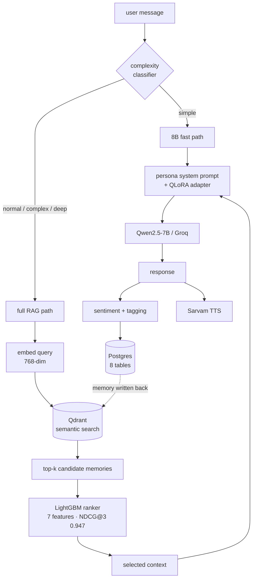

# Eka

**Live:** [the-eka.vercel.app](https://the-eka.vercel.app) ·
**API:** [eka-backend-doau.onrender.com/health](https://eka-backend-doau.onrender.com/health)

A lifelong AI companion with four distinct personas, built on a retrieval
pipeline that remembers what you told it months ago and decides for itself
which of those memories matter right now.

Not a chat wrapper. The interesting part is everything between the question and
the model call: what gets recalled, how it is ranked, and how much compute the
answer is worth.

---

## The four modes

| Mode | What it is for |
|---|---|
| **founder** | Brutally honest operator. Unit economics, runway, the thing you are avoiding. |
| **chanakya** | Strategy and leverage. Power, incentives, who benefits. |
| **gita** | Meaning when something has already gone wrong. |
| **reflection** | Asks rather than answers. Turns the question back. |

Each is a separate system prompt, a separate dataset, and a separate QLoRA
adapter over the same 7B base — so switching modes changes how Eka thinks, not
just its tone.

---

## Architecture



**Why a ranker at all.** Cosine similarity returns what is *similar*, not what
is *useful*. A memory from yesterday about the same topic usually beats a
semantically closer one from a year ago, and something the user marked
important beats both. The ranker learns that trade-off over seven features —
similarity, recency, priority, access count, length, mode match, provenance —
and scores **NDCG@3 0.9466** on held-out data.

**Why a complexity classifier.** Most messages do not need retrieval, a 70B
model, or 2,000 tokens of context. Routing the cheap ones to a fast path is
what makes the thing affordable to run on free tiers.

---

## What is actually built

### Data pipeline — 3,200 pairs, quality-gated

Synthetic conversations generated through a rotating pool of free LLM providers
with per-key token pacing, then filtered before anything reaches training.

| persona | pairs | train / val |
|---|---:|---:|
| founder | 1,000 | 900 / 100 |
| chanakya | 600 | 540 / 60 |
| gita | 600 | 540 / 60 |
| reflection | 1,000 | 900 / 100 |
| **total** | **3,200** | **2,880 / 320** |

Five quality gates plus an LLM judge run on every pair: persona-marker
presence, near-duplicate detection, response-length bounds, one-question
discipline, and an advice-leakage check specific to `reflection`. A persona
that finishes short is regenerated rather than shipped — the gate refuses to
publish anything that is not `ok_to_train`, because the next step is a
multi-hour GPU run that bakes any defect permanently into weights.

**6,000 embedding triplets** over 3,200 unique anchors for the retrieval
fine-tune. Negatives are drawn from a *different* persona mode, which is
exactly the confusion the retriever needs to stop making.

### Serving

- **FastAPI backend** — 31 modules, 8 route groups (chat, memories, voice,
  goals, reflections, insights, preferences, health), 17k lines of Python.
- **Postgres (Supabase)** — 8 tables, alembic-migrated.
- **Qdrant** — 768-dim vectors, semantic memory search.
- **Sarvam AI** — TTS and STT, per-persona voices, Indian-language capable.
- **7/7 E2E tests** passing against a live backend.
- Graceful degradation everywhere: every response reports which services fell
  back, so a partial outage is visible rather than silent.

### Frontend

React + Vite + Tailwind, single screen, four mode buttons, hold-to-talk voice
in and spoken replies out. Every call goes through one API client — there are
no `fetch` calls in the UI.

---

## Model training

The persona adapters are **QLoRA over `Qwen2.5-7B-Instruct`**, 4-bit NF4, rank
8, trained on ChatML-formatted splits. Base model chosen for being ungated;
the pipeline previously targeted Llama-3-8B.

**Status: the training pipeline is built and validated end to end — the
adapters are not finished.** Runs reach the trainer, produce checkpoints, and
report loss; what has not yet happened is a full run landing an adapter on the
Hub. Measured throughput drove the current config (rank 8, micro-batch 4,
sequence ceiling 1,152 against a longest real example of 1,078 tokens).

Until they land, personas run from system prompts against the same base model,
which is why the product works today.

Auxiliary models in the same pipeline: embedding fine-tune (`bge-base`),
complexity and sentiment classifiers, and a summarizer.

---

## Tech stack

**ML** — PyTorch · transformers · TRL · PEFT · bitsandbytes · sentence-transformers · LightGBM
**Backend** — FastAPI · Postgres/Supabase · Qdrant · asyncpg · Pydantic
**Frontend** — React · Vite · Tailwind
**Infra** — Render · Vercel · Hugging Face Hub · Kaggle / Colab (T4)

### Deployed

Backend on Render free tier, frontend on Vercel. `/health` reports every
dependency separately rather than a single boolean, so a partial outage is
visible:

```json
{"status":"ok","environment":"render","llm_mode":"groq",
 "groq":true,"qdrant":true,"database":true,"sarvam_configured":true,
 "complexity":false,"ranker":false,"sentiment":false}
```

The three `false` values are deliberate. `ENABLE_LOCAL_CLASSIFIERS=false` on a
512 MB instance — torch plus transformers resident would blow the box before
FastAPI got a look in — so complexity and sentiment fall back to their
heuristic implementations and the ranker is not loaded in-process. Same
behaviour, cheaper; flip the flag on a paid instance to get the trained
versions.

Free instances cold-start in ~50 s after idling, which the frontend surfaces as
a connection indicator rather than a hang.

---

## Run it

```bash
git clone https://github.com/Aarti-panchal01/eka.git && cd eka
cp .env.example .env          # fill in the keys
python scripts/verify_credentials.py   # checks every one of them for real

cd backend && python -m uvicorn main:app --port 8091
```

```bash
cd frontend && npm install
cp .env.example .env          # VITE_EKA_API_URL=http://localhost:8091
npm run dev
```

Regenerate data, or train:

```bash
python ml/scripts/run_queue.py --all        # generate all four personas
python ml/scripts/preprocess.py             # -> ChatML train/val splits
python scripts/preflight_kaggle.py --hub    # refuses to waste a GPU session
python scripts/build_kaggle_notebooks.py    # notebooks are generated, not hand-edited
```

`training/*.py` is the single source of truth; both the Kaggle and Colab
notebooks are generated from it and `--check` fails if they drift.

---

## Notes from building it

A few things that cost real time and are written into the code as comments so
they are not rediscovered:

- **Pacing is token-bound, not request-bound.** Going "faster" than the token
  budget makes a generation run strictly slower — one misconfiguration turned a
  6-hour job into a 6-day one.
- **A trailing comma discarded ~40% of generated batches.** `...right now?", } ]`
  is invalid strict JSON, so a whole five-pair call was thrown away. Fixing it
  closed the hardest remaining pairs within two minutes.
- **Never pin a stale stack against a managed image.** Pinning `numpy<2.0` on a
  host built around NumPy 2 produced a mixed-ABI crash one cell after the pin
  appeared to succeed.
- **Verify the artifact, not the exit code.** A training notebook can finish
  cleanly having pushed nothing at all.
