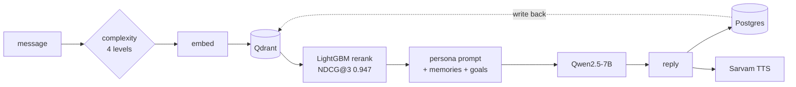

# Eka — Your Lifelong AI Companion

Four AI personas. Semantic memory that survives every conversation. Indian
voice, in your language.

**[Live →](https://the-eka.vercel.app)** · [API health](https://eka-backend-doau.onrender.com/health)

---

## What Eka does differently

Not a chat wrapper. The interesting part is everything between the question and
the model call.

- **Remembers across conversations** — semantic RAG over your own history, not
  a rolling context window
- **Routes by complexity** — four levels, and cheap questions never pay for
  deep retrieval
- **Speaks your language** — English, Hindi, Kannada, with per-persona voices
- **Four distinct minds**, each with its own dataset and adapter
- **Ranks memories by usefulness**, not just similarity

## The four personas

**⚡ Founder** — Brutally honest. Challenges assumptions, uses real startup
frameworks, ends on a sharp question.

**🛡 Chanakya** — Strategic and cold. Power dynamics, leverage, Arthashastra.
*"What is the one move available to you right now?"*

**✨ Gita** — Bhagavad Gita wisdom. Dharma, karma, detachment from outcomes.

**👁 Reflection** — CBT/ACT shaped. Never advises. Reflects, observes, asks.

---

## Architecture



### Retrieval budget scales with complexity

Most messages do not need deep retrieval. Paying for it anyway is what makes
these systems slow and expensive.

| Level | Memories | History turns | Candidate pool |
|---|---|---|---|
| Simple | 1 | 2 | 10 |
| Normal | 2 | 3 | 15 |
| Complex | 3 | 5 | 25 |
| Deep | 5 | 7 | 40 |

### Why a learned ranker

Cosine similarity returns what is *similar*, not what is *useful*. A memory
from yesterday usually beats a semantically closer one from a year ago, and
something you marked important beats both.

**LightGBM `LGBMRanker`, NDCG@3 = 0.9466** on held-out data, over seven
features: similarity, recency, priority, access count, length, mode match,
provenance. Reproducible with `python training/train_ranker_local.py`.

### Data pipeline — 3,200 pairs, quality-gated

| persona | pairs | train / val |
|---|---:|---:|
| founder | 1,000 | 900 / 100 |
| chanakya | 600 | 540 / 60 |
| gita | 600 | 540 / 60 |
| reflection | 1,000 | 900 / 100 |

Generated through a rotating pool of four free providers (Groq, Mistral ×4
keys, Google, OpenRouter) with per-key token pacing. Five gates plus an LLM
judge run on every pair: persona markers, response-length bounds,
one-question discipline, advice-leakage detection for `reflection`, and
near-duplicate rejection.

**The duplicate threshold is 0.75 Jaccard, and it is empirical, not chosen for
looking round.** At 0.75: 100% recall on clones, 0% false positives on the
hardest real collision. At 0.85 clone recall collapses to 21%.

Plus **6,000 embedding triplets** over 3,200 unique anchors, negatives drawn
from a *different* persona — exactly the confusion a retriever needs to stop
making.

### Voice

- **STT** — Sarvam `saarika:v2.5`, plus browser Web Speech for zero-latency dictation
- **TTS** — Sarvam `bulbul:v3`, per-persona speaker and pace:

| persona | speaker | pace | same line |
|---|---|---|---|
| founder | aditya | 1.10 | 4.51s |
| chanakya | ashutosh | 0.90 | 5.30s |
| gita | priya | 0.85 | 5.89s |
| reflection | kavya | 0.75 | 6.47s |

Questions are sent as their own request so they carry their own intonation.
Sentence breaks become `...` for real pauses — measured 2.48s → 3.6s on the
same two sentences.

---

## Evaluation

n=50 held-out prompts from `founder_val.jsonl` — the split that was actually
withheld from training. Four mechanical checks per response, no judge model.
`gold` scores the dataset's own answers, as an upper bound.

| Configuration | Persona score | Ends w/ question | Uses framework | No hedging | Words in band | Mean words |
|---|---|---|---|---|---|---|
| Training data (gold) | **94%** (3.74/4) | 78% | 100% | 96% | 100% | 189 |
| Base + prompt, no RAG | **93%** (3.73/4) | 100% | 100% | 100% | 73% | 159 |
| RAG + ranker (deployed) | **78%** (3.14/4) | 90% | 82% | 82% | 60% | 215 |
| Fine-tuned + RAG + ranker | _pending_ | — | — | — | — | — |

| Configuration | Memories retrieved | Precision@3 | Median latency |
|---|---|---|---|
| No RAG | — | — | **1,168 ms** |
| RAG + ranker | 4.7 | _needs labels_ | **16,796 ms** |

### What this actually says

**A base model with the persona prompt already scores 93% against gold's 94%.**
On these four checks, prompting is essentially at the ceiling — which sets a
real bar for the fine-tune to clear rather than assuming it helps.

**The two rows are not a clean ablation.** The no-RAG row runs
`llama-3.3-70b-versatile`; the deployed backend answers on
`llama-3.1-8b-instant`. So the 93→78 drop confounds *model size* with
*retrieval*, and the honest conclusion is "not yet measured", not "RAG hurts".
Fixing it means pinning both rows to the same model.

**These checks measure format, not substance.** The base model is *more*
mechanically compliant than gold — 100% of its answers end in a question
against gold's 78%. A fine-tune that copies the training distribution would
score slightly lower here and might still be better. Judging that needs blind
pairwise preference, which is the next thing to build.

**Precision@3 is deliberately blank.** Counting retrieved memories is not
knowing they were useful. `feedback_service` is now collecting implicit labels
from real sessions to fill it.

Reproduce: `python ml/eval/eval_harness.py`

## Status — what is trained, and what is not

Being straight about this, because the repo is public and anyone can check the
Hub in thirty seconds.

| Component | State |
|---|---|
| Data pipeline (3,200 pairs, 6,000 triplets) | **done, on the Hub** |
| LightGBM ranker (NDCG@3 0.9466) | **trained, reproducible** |
| Backend, RAG pipeline, voice, 5-screen UI | **done, deployed** |
| Persona QLoRA adapters | **training pipeline validated, adapters not finished** |
| Embedding / complexity / sentiment / summarizer models | **scripts written, not yet trained** |

Personas today run from system prompts against Qwen2.5-7B via Groq, which is
why the product works end to end right now. Complexity and sentiment run their
heuristic implementations — the free tier has 512MB, and `torch` plus
`transformers` resident does not fit alongside FastAPI.

The QLoRA config, measured on a real T4: **r=8, α=32, 2 epochs, effective batch
16, seq 1152**. That sequence length is not a guess — the longest example in
any split is 1,078 tokens, and the original 2,048 was pure padding cost.

---

## Tech stack

| Layer | Technology |
|---|---|
| Frontend | React · Vite · Tailwind |
| Backend | FastAPI · SQLAlchemy async · Pydantic |
| Database | Supabase (PostgreSQL), 8 tables, alembic |
| Vector DB | Qdrant Cloud, 768-dim |
| LLM | Qwen2.5-7B-Instruct via Groq |
| Voice | Sarvam AI — Bulbul v3, Saarika v2.5 |
| Training | Kaggle / Colab T4, QLoRA via TRL + PEFT |
| Deploy | Vercel + Render |

## Run it

```bash
git clone https://github.com/Aarti-panchal01/eka && cd eka
cp .env.example .env                      # fill in keys
python scripts/verify_credentials.py      # checks every one for real

cd backend && pip install -r requirements.txt
uvicorn main:app --reload --port 8091
```

```bash
cd frontend && npm install
echo "VITE_EKA_API_URL=http://localhost:8091" > .env
npm run dev
```

Regenerate data or train:

```bash
python ml/scripts/run_queue.py --all       # generate all four personas
python ml/scripts/preprocess.py            # -> ChatML splits
python scripts/preflight_kaggle.py --hub   # refuses to waste a GPU session
python scripts/build_kaggle_notebooks.py   # notebooks are generated, not edited
```

---

## Things that cost real time

Written into the code as comments so they are not rediscovered:

- **Pacing is token-bound, not request-bound.** Going "faster" than the token
  budget made one generation run 6 days instead of 6 hours.
- **A trailing comma discarded ~40% of generated batches.** `...right now?", } ]`
  is invalid strict JSON, so a whole five-pair call was thrown away.
- **Never pin a stale stack against a managed image.** `numpy<2.0` on a host
  built around NumPy 2 produced a mixed-ABI crash one cell after the pin
  appeared to succeed.
- **Verify the artifact, not the exit code.** A training notebook can finish
  cleanly having pushed nothing at all.
- **A field that never enters the app cannot leak.** Routing internals are
  stripped in the API client, not hidden in the view.

---

## Built by

**Aarti Panchal** — B.Tech AI & ML, PES University Bengaluru
C4GT DMP '26 Fellow

[LinkedIn](https://linkedin.com/in/aarti-panchal) ·
[GitHub](https://github.com/Aarti-panchal01) ·
[Portfolio](https://aarti-tech-portfolio.vercel.app)

---

*Eka is Sanskrit for "one" — the one companion that knows you completely.*
