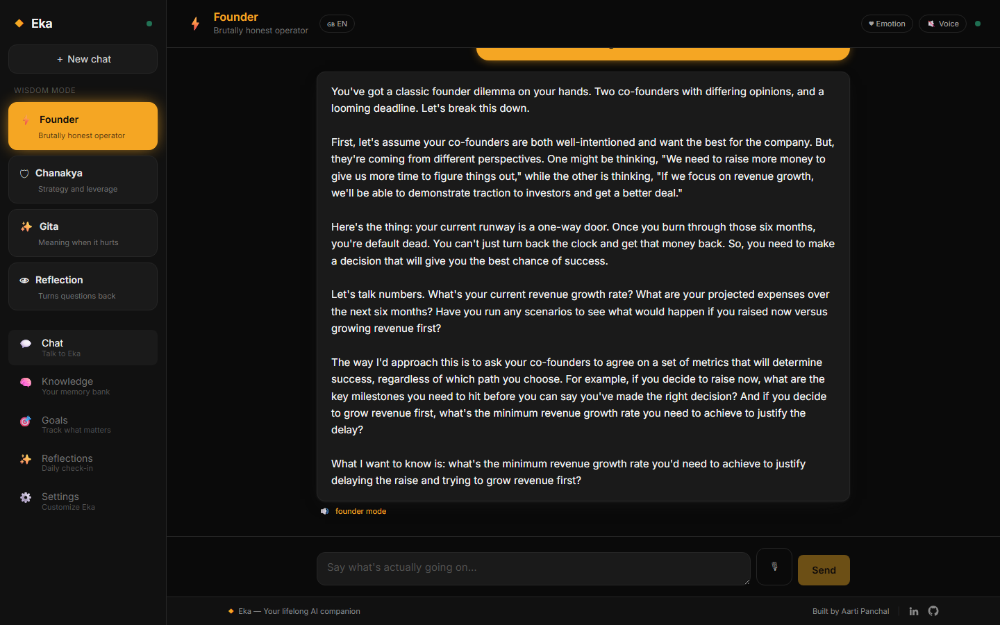
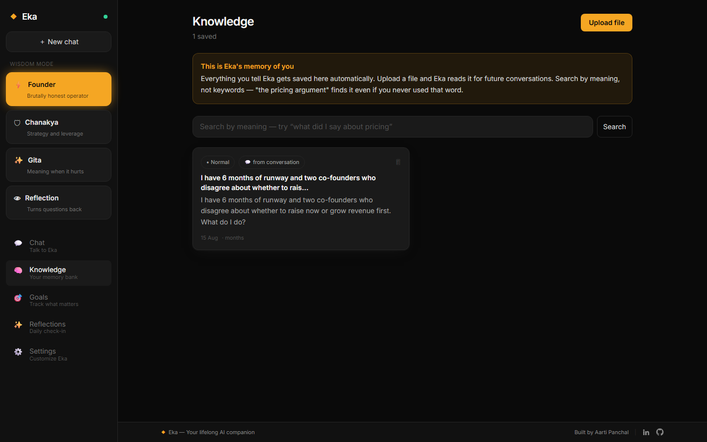
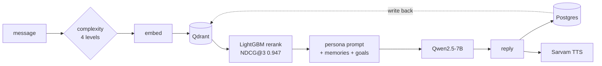

<div align="center">

# Eka

**Your lifelong AI companion — four personas, semantic memory that survives every
conversation, and an Indian voice in your language.**

[](https://the-eka.vercel.app)
[](https://eka-backend-doau.onrender.com/health)
[](https://huggingface.co/amijackofalltrades)
[](https://python.org)
[](https://fastapi.tiangolo.com)
[](https://react.dev)
[](LICENSE)

</div>

---

Not a chat wrapper. The interesting part is everything between the question and
the model call: a complexity router that decides how much retrieval a message
deserves, a learned ranker that scores memories by usefulness rather than
similarity, and a data pipeline that refuses most of what it generates.

Every number below is measured and reproducible. The ones that are unflattering
are here too, with the reason.

<p align="center">
  
  
</p>

<p align="center"><em>Left: the Founder persona, live. Right: the same message
already stored as a searchable memory, tagged with the complexity level that
decided its retrieval budget.</em></p>

## Contents

[What it does](#what-eka-does-differently) ·
[Personas](#the-four-personas) ·
[Architecture](#architecture) ·
[Under the hood](#under-the-hood) ·
[Trained models](#trained-models) ·
[Evaluation](#evaluation) ·
[Fine-tuning](#fine-tuning--validated-paused) ·
[Status](#status) ·
[Run it](#run-it) ·
[Engineering notes](#engineering-notes)

---

## What Eka does differently

- **Remembers across conversations** — semantic RAG over your own history, not
  a rolling context window
- **Routes by complexity** — four levels, and cheap questions never pay for
  deep retrieval
- **Ranks memories by usefulness**, not just similarity — a learned ranker,
  not cosine
- **Speaks your language** — English, Hindi, Kannada, with per-persona voices
- **Four distinct minds**, each with its own dataset, prompt and voice

## The four personas

| | Persona | Behaviour |
|---|---|---|
| ⚡ | **Founder** | Brutally honest. Challenges assumptions, uses real startup frameworks, ends on a sharp question. |
| 🛡 | **Chanakya** | Strategic and cold. Power dynamics, leverage, Arthashastra. *"What is the one move available to you right now?"* |
| ✨ | **Gita** | Bhagavad Gita wisdom. Dharma, karma, detachment from outcomes. |
| 👁 | **Reflection** | CBT/ACT shaped. Never advises. Reflects, observes, asks. |

---

## Architecture



### Retrieval budget scales with complexity

Most messages do not need deep retrieval. Paying for it anyway is what makes
these systems slow and expensive.

| Level | Memories | History turns | Candidate pool |
|---|---:|---:|---:|
| Simple | 1 | 2 | 10 |
| Normal | 2 | 3 | 15 |
| Complex | 3 | 5 | 25 |
| Deep | 5 | 7 | 40 |

---

## Under the hood

### Data pipeline — 3,200 pairs, quality-gated

Anyone can prompt an LLM into 3,200 rows. The work is refusing most of them.

| persona | pairs | train / val |
|---|---:|---:|
| founder | 1,000 | 900 / 100 |
| chanakya | 600 | 540 / 60 |
| gita | 600 | 540 / 60 |
| reflection | 1,000 | 900 / 100 |

Generated through a rotating pool of four free providers (Groq, Mistral ×4
keys, Google, OpenRouter) with per-key token pacing. Every pair passes five
gates plus an LLM judge before it can reach training, and a persona that
finishes short is regenerated rather than shipped:

- **Persona markers** — does the response actually behave like the persona
- **Length floors and ceilings** — 150–250 words, enforced
- **One-question discipline** — exactly one closing question, not three
- **Advice-leakage detection** — `reflection` must never give advice, and a
  regex misses paraphrase, so an 8B LLM judge classifies it semantically
- **Near-duplicate rejection** — Jaccard at **0.75**

**That threshold is derived, not chosen for looking round.** At 0.75: 100%
recall on clones, 0% false positives against the hardest real collision in the
corpus. At 0.85, clone recall collapses to **21%**. Jaccard is always the lower
of the two measures — for equal-sized sets, cosine 0.75 is Jaccard 0.60 — which
is why the number cannot be lifted from a paper that used cosine.

The gate refuses to publish anything not marked `ok_to_train`, because the next
step is a multi-hour GPU run that bakes any defect permanently into weights.

### Persona-conditioned retrieval

**6,000 embedding triplets over 3,200 unique anchors**, and the interesting
part is the negatives: each one is drawn from a **different persona's**
conversations.

That trains the retriever on the confusion that actually matters here. Generic
negatives teach "these two texts are unrelated", which cosine similarity
already knows. Persona negatives teach something harder — *the same topic,
discussed in a different register, is not the memory you want.* Founder talking
about failure and Gita talking about failure are semantically adjacent and
functionally opposite.

### A learned ranker, because similarity is the wrong objective

Cosine returns what is *similar*, not what is *useful*. A memory from yesterday
usually beats a semantically closer one from a year ago, and something the user
flagged important beats both.

**LightGBM `LGBMRanker`, NDCG@3 = 0.9466** on held-out data, over seven
features: similarity, recency, priority, access count, length, mode match,
provenance. Reproducible with `python training/train_ranker_local.py`.

Its honest weakness, stated because a reader will find it: it is trained on
synthetic data from `make_dataset()`. `feedback_service` is now collecting
implicit relevance labels from live sessions — which memories were retrieved,
and whether the user stayed on that thread — to retrain against real signal.

### Voice

- **STT** — Sarvam `saarika:v2.5`, plus browser Web Speech for zero-latency dictation
- **TTS** — Sarvam `bulbul:v3`, per-persona speaker and pace:

| persona | speaker | pace | same line |
|---|---|---:|---:|
| founder | aditya | 1.10 | 4.51s |
| chanakya | ashutosh | 0.90 | 5.30s |
| gita | priya | 0.85 | 5.89s |
| reflection | kavya | 0.75 | 6.47s |

Questions are sent as their own request so they carry their own intonation.
Sentence breaks become `...` for real pauses — measured 2.48s → 3.6s on the
same two sentences.

---

## Trained models

Four supervised models, trained and live on the Hub.

| Model | Task | Result | Data |
|---|---|---|---|
| **eka-sentiment** — DistilRoBERTa | 6-class emotion | **72.4% acc · 0.721 F1-weighted** | GoEmotions, 42k train / 5.2k test |
| **eka-summarizer** — T5-small | dialogue summary | **ROUGE-L 37.01 · ROUGE-1 44.37** | SAMSum, 14.7k |
| **eka-complexity** — DistilBERT | 4-class routing | 100% acc — *see caveat* | 2,000 synthetic |
| **eka-ranker** — LightGBM | memory rerank | **NDCG@3 0.9466** | synthetic |

### Sentiment — the honest result

72.4% on six classes, on a real external benchmark, with the confusion matrix
published rather than summarised:

| class | precision | recall | F1 | support |
|---|---:|---:|---:|---:|
| positive | 0.797 | 0.853 | 0.824 | 1,873 |
| neutral | 0.733 | 0.679 | 0.705 | 1,962 |
| negative | 0.648 | 0.687 | 0.667 | 891 |
| reflective | 0.472 | 0.447 | 0.459 | 342 |
| anxious | 0.624 | 0.700 | 0.660 | 90 |
| motivated | 0.700 | **0.378** | 0.491 | 74 |

The weak rows are the interesting ones. `motivated` has 74 test examples and
recall of 0.378 — it is mostly being read as `positive`, which is a defensible
confusion and a class-imbalance problem, not a modelling mystery. `reflective`
overlaps `neutral` for the same reason. Both are stated rather than hidden
behind the 72.4%.

### Complexity — 100%, and why that number is not a win

The classifier scores 1.0000 on held-out data. That is a **property of the
dataset, not the model.**

Word count per class, measured:

| class | word range | median |
|---|---:|---:|
| simple | 1–7 | 3 |
| normal | 5–17 | 6 |
| complex | 21–38 | 27 |
| deep | 59–76 | 69 |

`normal→complex` and `complex→deep` do not overlap at all. **A three-threshold
word-count rule scores 93.6% on the same data.** DistilBERT's extra 6.4 points
are real but modest, and what it mostly learned was to count.

The generator also left lexical tells — every `deep` example follows *"I realize
I always X when Y. It happened with Z"*. So the honest reading is: the router
works in production and routes correctly, and its accuracy figure measures how
separable the synthetic data is. Validating it needs real user queries, which
is what the deployed logging now collects.

That caveat applies to the ranker too — same synthetic-data provenance, same
reason `feedback_service` exists.

---

## Evaluation

n=50 held-out prompts from `founder_val.jsonl` — the split that was actually
withheld from training. Four mechanical checks per response, no judge model.
`gold` scores the dataset's own answers, as an upper bound.

| Configuration | Persona score | Ends w/ question | Uses framework | No hedging | Words in band | Mean words |
|---|---|---:|---:|---:|---:|---:|
| Training data (gold) | **94%** (3.74/4) | 78% | 100% | 96% | 100% | 189 |
| Base + prompt, no RAG | **93%** (3.73/4) | 100% | 100% | 100% | 73% | 159 |
| RAG + ranker (deployed) | **78%** (3.14/4) | 90% | 82% | 82% | 60% | 215 |
| Fine-tuned + RAG + ranker | _pending_ | — | — | — | — | — |

| Configuration | Memories retrieved | Precision@3 | Median latency |
|---|---:|---|---:|
| No RAG | — | — | **1,168 ms** |
| RAG + ranker | 4.7 | _needs labels_ | **16,796 ms** |

### What this actually says

**A base model with the persona prompt already scores 93% against gold's 94%.**
On these four checks, prompting is essentially at the ceiling — which sets a
real bar for any fine-tune to clear rather than assuming it helps. Finding that
out before spending GPU hours is the entire point of building the harness
first.

**The two rows are not a clean ablation.** The no-RAG row runs
`llama-3.3-70b-versatile`; the deployed backend answers on
`llama-3.1-8b-instant`. So the 93→78 drop confounds *model size* with
*retrieval*, and the honest conclusion is "not yet measured", not "RAG hurts".
Fixing it means pinning both rows to the same model.

**These checks measure format, not substance.** The base model is *more*
mechanically compliant than gold — 100% of its answers end in a question
against gold's 78%. A fine-tune that copies the training distribution would
score slightly lower here and might still be better. Judging that needs blind
pairwise preference, which is the next thing to build.

**Precision@3 is deliberately blank.** Counting retrieved memories is not
knowing they were useful. `feedback_service` is now collecting implicit labels
from real sessions to fill it.

Reproduce: `python ml/eval/eval_harness.py`

---

## Fine-tuning — validated, paused

QLoRA fine-tuning validated end to end on a Colab T4: 4-bit NF4 load, LoRA
attach (**20,185,088 trainable, 0.264% of 7,635,801,600**), optimizer steps
executing at a measured **304 s/step**.

Config, every value chosen from measurement: **r=8, α=16, 2 epochs, effective
batch 16, seq 1152**. That sequence length is not a guess — the longest example
in any split is 1,078 tokens, and the original 2,048 was pure padding cost, so
roughly half of every batch was pad tokens paid for at full price.

**Full adapter training is paused on session constraints, not pipeline faults.**
At 304 s/step a T4 needs ~9.5h for the four personas' 318 steps, against a free
tier that caps near 12h and drops idle sessions well before that. The runs that
died died to a session cap and a GPU-quota exhaustion; every code-level failure
along the way — a stale r=16 checkpoint, a traceback pinning 7.9GB of GPU past
the failure that caused it — is fixed and regression-tested in
`ml/tests/test_checkpoint_guard.py`.

**Personas today are served via system prompts against Qwen2.5-7B-Instruct —
functionally complete and deployed.** That is not a placeholder for the
fine-tune so much as the thing the fine-tune has to beat: the eval harness
above measured prompting at **93%** against the training data's own **94%**,
so the ceiling was already known before any GPU hour was spent. When an
adapter completes it hot-swaps in behind the existing `LLM_MODE` switch and
fills its pending row in the eval table.

---

## Status

| Component | State |
|---|---|
| Data pipeline — 3,200 gated pairs, 6,000 triplets | **done, on the Hub** |
| Sentiment — DistilRoBERTa, 72.4% on GoEmotions | **trained, on the Hub** |
| Summarizer — T5-small, ROUGE-L 37.01 on SAMSum | **trained, on the Hub** |
| Complexity router — DistilBERT | **trained, on the Hub** (see caveat) |
| LightGBM ranker — NDCG@3 0.9466 | **trained, deployed, reproducible** |
| Evaluation harness + ablation table | **done, results published above** |
| Implicit relevance logging | **live, collecting** |
| Backend, RAG, voice, 5-screen UI | **done, deployed** |
| QLoRA training pipeline | **validated end to end on T4, 304 s/step** |
| Persona adapters | **paused — served via system prompts, deployed** |
| Embedding fine-tune | **script written, not trained** |

Personas today run from system prompts against Qwen2.5-7B via Groq, which is
why the product works end to end right now. Complexity and sentiment run
heuristic implementations in production — the free tier has 512MB, and `torch`
plus `transformers` resident does not fit alongside FastAPI.

---

## Tech stack

| Layer | Technology |
|---|---|
| Frontend | React · Vite · Tailwind |
| Backend | FastAPI · SQLAlchemy async · Pydantic |
| Database | Supabase (PostgreSQL), 8 tables, alembic |
| Vector DB | Qdrant Cloud, 768-dim |
| LLM | Qwen2.5-7B-Instruct via Groq |
| Voice | Sarvam AI — Bulbul v3, Saarika v2.5 |
| Training | Colab T4 — QLoRA via TRL + PEFT, classifiers via Transformers |
| Deploy | Vercel + Render |

---

## Run it

**Backend**

```bash
git clone https://github.com/Aarti-panchal01/eka && cd eka
cp .env.example .env                      # fill in keys
python scripts/verify_credentials.py      # checks every one for real

cd backend && pip install -r requirements.txt
uvicorn main:app --reload --port 8091
```

**Frontend**

```bash
cd frontend && npm install
echo "VITE_EKA_API_URL=http://localhost:8091" > .env
npm run dev
```

**Regenerate data, or train**

```bash
python ml/scripts/run_queue.py --all        # generate all four personas
python ml/scripts/preprocess.py             # -> ChatML train/val splits
python ml/scripts/upload_to_hf.py           # publish gated datasets
python ml/eval/eval_harness.py              # reproduce the ablation table
python training/train_ranker_local.py       # reproduce NDCG@3 0.9466

python scripts/build_colab_notebooks.py     # notebooks are generated, not edited
python scripts/build_colab_notebooks.py --check   # fails if a notebook drifted
```

Notebooks in `ml/notebooks/` are generated from `training/*.py`. Edit the `.py`,
never the `.ipynb` — `--check` fails the moment the two disagree.

---

## Engineering notes

Written into the code as comments so they are not rediscovered:

- **Pacing is token-bound, not request-bound.** Going "faster" than the token
  budget made one generation run 6 days instead of 6 hours.
- **A trailing comma discarded ~40% of generated batches.** `...right now?", } ]`
  is invalid strict JSON, so a whole five-pair call was thrown away.
- **Never pin a stale stack against a managed image.** `numpy<2.0` on a host
  built around NumPy 2 produced a mixed-ABI crash one cell after the pin
  appeared to succeed.
- **Verify the artifact, not the exit code.** A training notebook can finish
  cleanly having pushed nothing at all.
- **A caught exception holds the GPU.** Its traceback keeps the failing frame
  alive, and with it a 7.9GB model — so the persona that OOMs is the one
  *after* the one that broke.
- **A field that never enters the app cannot leak.** Routing internals are
  stripped in the API client, not hidden in the view.

---

## Built by

**Aarti Panchal** — B.Tech AI & ML, PES University Bengaluru
C4GT DMP '26 Fellow

[LinkedIn](https://linkedin.com/in/aarti-panchal) ·
[GitHub](https://github.com/Aarti-panchal01) ·
[Portfolio](https://aarti-tech-portfolio.vercel.app)

Licensed under [MIT](LICENSE).

---

<div align="center">

*Eka is Sanskrit for "one" — the one companion that knows you completely.*

</div>
